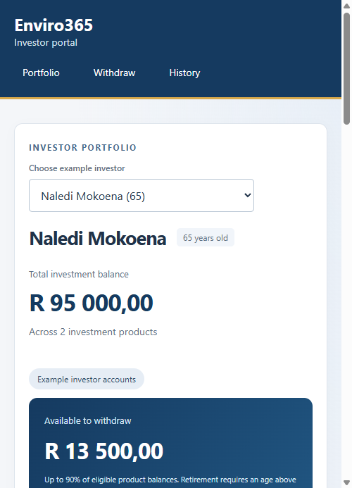

# Enviro365 Investor Portal

A Spring Boot application for viewing investor portfolios, creating withdrawal notices and downloading filtered CSV statements. The UI uses HTML, CSS and JavaScript and is served by the same application.

## Setup

You need a JDK (Java 17 or newer). Set `JAVA_HOME` to your JDK folder. Maven is included through the wrapper, so a separate Maven installation is not needed. The first build needs internet access to download dependencies.

Open this project's `pom.xml` in IntelliJ and run `InvestorPortalAssessmentApplication`, or use a terminal from the project root:

```powershell
.\mvnw.cmd spring-boot:run
```

On macOS/Linux, use `./mvnw spring-boot:run` instead. If needed, make the wrapper executable with `chmod +x mvnw`.

Open **http://localhost:8080/**. There is no separate frontend server, npm installation or external chart library.

To build and test:

```powershell
.\mvnw.cmd verify
java -jar target/investor-portal-0.0.1-SNAPSHOT.jar
```

Stop the running application before starting another copy on port 8080. If that port is busy, run `java -jar target/investor-portal-0.0.1-SNAPSHOT.jar --server.port=8081` and open port 8081 instead.

## Database and example investors

H2 saves the data to `data/investor-portal.mv.db`. Balances and notices survive application restarts. The `data` folder is ignored by Git. For a fresh local database, stop the app and remove the `data` folder before restarting it.

The first start creates three example investors with two products each:

| Investor | Initial age | Retirement balance | Savings balance |
| --- | --- | --- | --- |
| Thabo Dlamini | 67 | R100,000 | R20,000 |
| Naledi Mokoena | 65 | R80,000 | R15,000 |
| Sipho Nkosi | 40 | R50,000 | R30,000 |

These are labelled example accounts, not real investor records. Their dates of birth are calculated when the database is first created; displayed ages are then calculated from those saved dates. Existing data is not reset on restart. The accounts also include clearly labelled sample withdrawals from preceding months. No investment growth is simulated.

The selector demonstrates different portfolios and age rules. It is not a login system. Authentication and transferring real money are outside this assessment's scope.

The H2 console is available locally at **http://localhost:8080/h2-console**. Use JDBC URL `jdbc:h2:file:./data/investor-portal`, username `sa` and an empty password. This is a local assessment configuration, not a production security setup.

## Using the application

1. Choose an example investor. The portfolio shows their details, products, total balance and eligible withdrawal amount.
2. Select a product, enter an amount and create a withdrawal notice.
3. View the saved notice and updated balance. The pie chart updates automatically.
4. Filter history by product, From date or To date, then choose **Download CSV**. The total withdrawn amount updates for the selected product and date range. The backend exports the same filtered records.


## Validation rules

- Retirement withdrawals require a completed age **greater than 65**. Exactly 65 is rejected; 66 is allowed.
- Amounts must be positive and have at most two decimal places.
- A withdrawal cannot exceed the selected product's balance or 90% of its current balance.
- The maximum is rounded down to cents. Exactly 90% is allowed.
- The selected product must belong to the selected investor.
- From date cannot be after To date. Date filters include both endpoints.

The UI checks inputs for quick feedback, and the backend repeats the checks. The notice and balance are saved in one transaction. A database lock protects a product balance during concurrent withdrawals.

## API documentation

See [API.md](docs/API.md) for endpoints, request/response examples, filters and error codes.

## Code layout

The Java package is `com.enviro.assessment.junior.thabiso.kojoana`.

```text
src/main/java/.../kojoana/
  controller/   HTTP endpoints
  dto/          Request and response fields
  model/        H2/JPA entities
  repository/   Database access
  service/      Portfolio calculations and withdrawal rules
  exception/    Useful API errors
  config/       First-start example accounts
src/main/resources/static/
  index.html
  css/styles.css
  js/index.js
src/test/       Automated tests and separate test database settings
```

Four advanced options are included: a DTO layer, input validation, automated tests and UI validation. Expected request errors are handled inside the portfolio controller.

## Testing

`mvnw verify` runs 27 automated checks: the startup check, withdrawal-rule tests and API integration tests. They cover ages around 65, the 90% boundary, invalid amounts, ownership, saved balances, filtered CSV output, notice retrieval and concurrent withdrawals. Tests use an isolated in-memory H2 database and do not change the normal file database.

The UI was also checked in Chrome with a separate database: profile switching, inline errors, successful withdrawals, persistence after refresh, date/product filters, an actual CSV download, pie chart updates and the mobile layout. File-database persistence was checked across an application restart.

## Screenshots

Screenshots show example accounts and notices created during verification.

### Portfolio


### Validation


### Filtered history


### Mobile


## AI usage

I used ChatGPT/Codex to explain the assessment, build and refine the UI, implement the Spring Boot backend, add tests, debug the integration and prepare documentation. Most of the implementation was AI-assisted. The comments explain the main decisions; this disclosure does not claim that the code was written without AI help.

## Assumptions

Products are treated as retirement or savings investments. Creating a withdrawal notice immediately reduces its balance, as required by the balance-calculation exercise. There is no separate payment approval or settlement process. Dates and ages use the application's local timezone. The example-account selector is for assessment review, so the application does not provide production authentication.

### Sample withdrawal history

Fresh databases include three sample withdrawals for Thabo (retirement and savings), and two each for Naledi and Sipho (savings only). Amounts vary and dates are one month apart. Retirement samples follow the over-65 rule. Earlier balances account for these withdrawals and end at the current portfolio balances. Existing history is preserved; restarting does not duplicate records. These examples help demonstrate history filters and CSV downloads.
