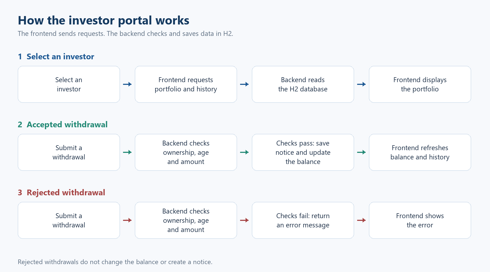
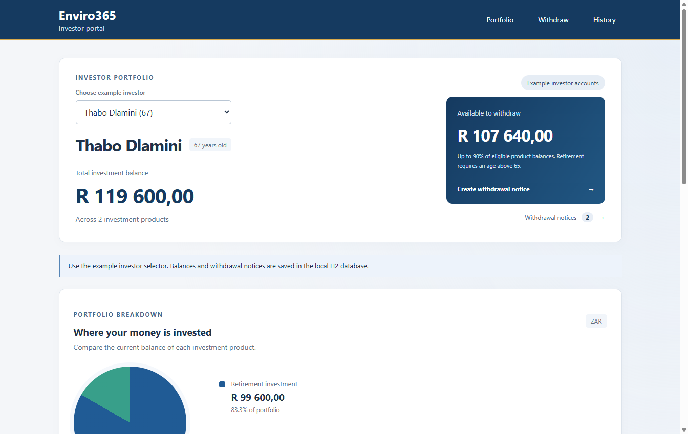
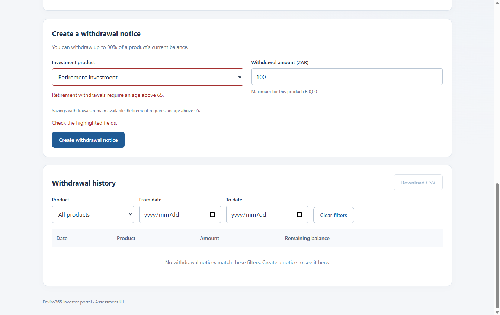
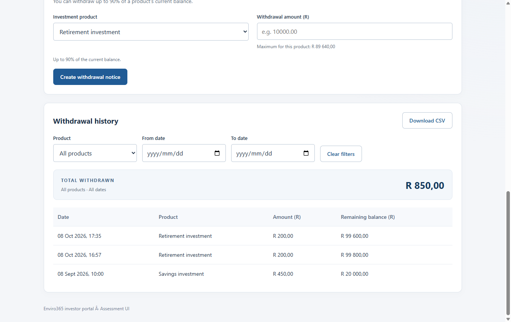

# Enviro365 Investor Portal

A Spring Boot application for viewing investor portfolios, creating withdrawal notices and downloading filtered CSV statements. The UI uses HTML, CSS and JavaScript and is served by the same application.

## Setup

You need a JDK (Java 17 or newer). Set `JAVA_HOME` to your JDK folder. Maven is included through the wrapper, so a separate Maven installation is not needed. The first build needs internet access to download dependencies.

Open this project's `pom.xml` in IntelliJ and run `InvestorPortalAssessmentApplication`, or use a terminal from the project root:

```powershell
.\mvnw.cmd spring-boot:run
```

On macOS/Linux, use `./mvnw spring-boot:run` instead. If needed, make the wrapper executable with `chmod +x mvnw`.

Open **http://localhost:8080/**. There is no separate frontend server, npm installation or external chart library.

To build and test:

```powershell
.\mvnw.cmd verify
java -jar target/investor-portal-0.0.1-SNAPSHOT.jar
```

Stop the running application before starting another copy on port 8080. If that port is busy, run `java -jar target/investor-portal-0.0.1-SNAPSHOT.jar --server.port=8081` and open port 8081 instead.

## Database and investor accounts

H2 saves the data to `data/investor-portal.mv.db`. Balances and notices survive application restarts. The `data` folder is ignored by Git. For a fresh local database, stop the app and remove the `data` folder before restarting it.

On first startup, the database creates three investor accounts with two products each:

| Investor | Initial age | Retirement balance (R) | Savings balance (R) |
| --- | --- | --- | --- |
| Thabo Dlamini | 67 | R 100 000 | R 20 000 |
| Naledi Mokoena | 65 | R 80 000 | R 15 000 |
| Sipho Nkosi | 40 | R 50 000 | R 30 000 |

Dates of birth are set when the database is first created, and ages are calculated from those saved dates. Account balances and withdrawal history are preserved when the application restarts.

Use the investor selector to view each account's portfolio and withdrawal eligibility. The application records withdrawal notices; it does not process bank payments.

The H2 console is available locally at **http://localhost:8080/h2-console**. Use JDBC URL `jdbc:h2:file:./data/investor-portal`, username `sa` and an empty password.

## Using the application

1. Choose an investor. The portfolio shows their details, products, total balance and eligible withdrawal amount.

2. Select a product, enter an amount and create a withdrawal notice. Confirm the product and amount in the confirmation message, or cancel to leave the balance unchanged.

3. View the saved notice and updated balance. The pie chart updates automatically.

4. History opens with the last three months selected. Choose 3 months, 6 months or Current month from the Period selector. Reset filters clears the dates and shows all history. Change the product, From date or To date, then choose **Download CSV**. The total withdrawn amount updates for the selected product and date range. The backend exports the same filtered records.

## Validation rules

- Retirement withdrawals require a completed age **greater than 65**. Exactly 65 is rejected; 66 is allowed.

- Amounts must be positive and have at most two decimal places.

- A withdrawal cannot exceed the selected product's balance or 90% of its current balance.

- The maximum is rounded down to cents. Exactly 90% is allowed.

- The selected product must belong to the selected investor.

- From date cannot be after To date. Date filters include both endpoints.

The UI checks inputs for quick feedback, and the backend repeats the checks. The notice and balance are saved in one transaction. A database lock protects a product balance during concurrent withdrawals.

## API documentation

See [API.md](docs/API.md) for endpoints, request/response examples, filters and error codes.

## Code layout

The Java package is `com.enviro.assessment.junior.thabiso.kojoana`.

```text
src/main/java/com/enviro/assessment/junior/thabiso/kojoana/
  controller/  → Receives HTTP requests and returns responses
  dto/         → Defines request and response fields
  service/     → Checks withdrawal rules and calculates balances
  repository/  → Reads and saves database records
  model/       → Defines the investor, product and withdrawal entities
  exception/   → Describes validation and missing-record errors
  config/      → Adds the initial accounts and withdrawal history

src/main/resources/static/
  index.html       → Dashboard structure
  css/styles.css   → Desktop styling
  js/index.js      → Loads accounts and displays the portfolio
  js/history.js    → Handles date filters, totals and CSV downloads
  js/withdrawal.js → Validates and confirms withdrawal requests

src/test/java/com/enviro/assessment/junior/thabiso/kojoana/
                   → JUnit rule, API and sample-history tests
src/test/resources/application.properties
                   → Isolated in-memory H2 test settings
```

A request follows this path:

```text
Frontend → Controller → Service → Repository → H2 database
Frontend ← Controller ← Service ← Repository ← H2 database
```

### How it works

The diagram shows selecting an investor, an accepted withdrawal and a rejected withdrawal. A rejected withdrawal leaves the balance unchanged and creates no notice.



Four advanced options are included: a DTO layer, input validation, automated tests and UI validation. Expected request errors are handled inside the portfolio controller.

## Testing

`mvnw verify` runs 27 automated checks: the startup check, withdrawal-rule tests and API integration tests. They cover ages around 65, the 90% boundary, invalid amounts, ownership, saved balances, filtered CSV output, notice retrieval and concurrent withdrawals. Tests use an isolated in-memory H2 database and do not change the normal file database.

The UI was also checked in Chrome with a separate database: profile switching, inline errors, successful withdrawals, persistence after refresh, date/product filters, an actual CSV download, pie chart updates. File-database persistence was checked across an application restart.

## Screenshots

Screenshots show the portfolio, withdrawal validation and filtered history in the running application.

### Portfolio



### Validation



### Filtered history



## AI usage

I used Copilot and ChatGPT to support my development process. I first worked through the assessment requirements and planned my approach, then gave the tools specific context to help build and refine the UI. I implemented the Spring Boot backend, used Copilot to assist with writing tests, and troubleshot integration issues. I also prepared the documentation, using AI to improve the wording. Throughout the process, I guided the work, reviewed suggested changes against my understanding, and tested their behaviour rather than accepting AI-generated output without checking it. The code comments explain the main implementation decisions.

## Assumptions

Products are treated as retirement or savings investments. Creating a withdrawal notice immediately reduces its balance, as required by the balance-calculation exercise. There is no separate payment approval or settlement process. Dates and ages use the application's local timezone. Investors are selected from the account list; no login is required.

### Initial withdrawal history

A new database starts with three withdrawals for Thabo across retirement and savings, and two savings withdrawals each for Naledi and Sipho. Amounts vary and dates are one month apart. Retirement withdrawals follow the over-65 rule. Earlier balances account for these withdrawals and end at the current portfolio balances. Existing history is preserved, and restarting does not duplicate records. Use the product and date filters to review these withdrawals or export them as CSV.
